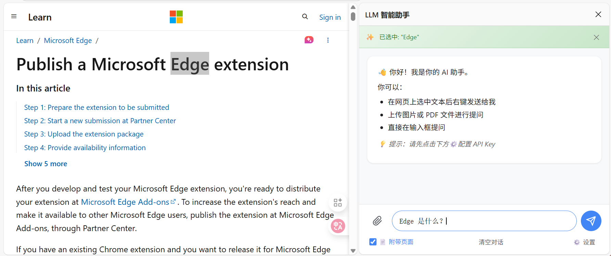

# LLM 智能助手 - Edge 浏览器侧边栏插件

一个支持 Gemini、OpenAI、Anthropic 等多种 LLM API 的 Edge 浏览器侧边栏插件，可以对网页划词或提供的资料进行对话提问。



## ✨ 功能特性

### 🎯 智能划词
- **自动识别选中**: 在网页上选中文字后，侧边栏自动显示待发送提示
- **快捷发送**: 按 Ctrl+Enter 即可将选中内容连同问题一起发送
- **右键菜单**: 选中文字后右键可直接发送到助手

### 📎 多附件支持
- **图片**: 支持上传图片、粘贴剪贴板图片、右键发送网页图片
- **PDF**: 支持上传 PDF 文件（Gemini 原生支持）
- **文本文件**: 支持各类代码文件、配置文件、Markdown 等
- **多选上传**: 可同时上传多个文件

### 🔢 数学公式渲染
- 使用 KaTeX 渲染 LaTeX 数学公式
- 支持行内公式 `$...$` 和块级公式 `$$...$$`
- AI 回复中的公式自动美化显示

### 🔧 多模型支持
- **Google Gemini**: Gemini 3 Pro Preview, 2.5 Pro, 2.5 Flash, 2.5 Flash Lite
- **OpenAI**: GPT-4o, GPT-4o Mini, GPT-4 Turbo, GPT-3.5 Turbo
- **Anthropic Claude**: Claude 3.5 Sonnet, Claude 3 Opus, Claude 3 Haiku

### 💡 其他特性
- 💬 **连续对话**: 保留上下文，支持多轮对话
- 📄 **页面上下文**: 可选择附带当前页面内容
- 📝 **系统提示词**: 可自定义 AI 的角色和行为
- 💾 **对话记录**: 自动保存对话历史
- 🎨 **简洁界面**: 清爽的侧边栏设计，支持附件预览

## 📦 安装方法

1. 打开 Edge 浏览器，进入 `edge://extensions/`
2. 开启右上角的 **"开发人员模式"**
3. 点击 **"加载解压缩的扩展"**
4. 选择此项目文件夹 `browser-ai-assistant`
5. 扩展安装完成！


## 🚀 使用方法

### 1. 配置 API Key

1. 点击扩展图标打开侧边栏
2. 点击右上角的 ⚙️ 设置按钮
3. 选择模型提供商（Gemini/OpenAI/Anthropic）
4. 输入对应的 API Key
5. 选择要使用的模型
6. （可选）设置系统提示词
7. 点击保存

### 2. 划词提问

1. 在任意网页上选中一段文字
2. 侧边栏会自动显示 "已选中: ..." 提示条
3. 在输入框中输入问题
4. 按 Enter 或 Ctrl+Enter 发送

### 3. 上传附件

- **点击上传**: 点击 📎 按钮选择文件（支持多选）
- **粘贴图片**: 在输入框中直接 Ctrl+V 粘贴图片
- **右键发送**: 在网页图片上右键选择发送到助手

### 4. 右键菜单

- 选中文字 → 右键 → "发送选中文本到 LLM 助手"
- 图片上 → 右键 → "发送此图片到 LLM 助手"

### 5. 快捷键

| 场景 | 快捷键 | 功能 |
|------|--------|------|
| 输入框聚焦 | Enter | 发送消息 |
| 输入框聚焦 | Shift+Enter | 换行 |
| 侧边栏任意位置 | Ctrl+Enter | 发送消息 |
| 网页中 | Ctrl+Enter | 发送消息到侧边栏 |

### 6. 附带页面内容

勾选输入框上方的 "📄 附带页面" 选项，发送时会自动包含当前页面的完整内容，方便 AI 理解上下文。

## 🔑 获取 API Key

### Google Gemini
1. 访问 [Google AI Studio](https://aistudio.google.com/app/apikey)
2. 登录 Google 账户
3. 点击 "Create API Key"
4. 复制生成的 API Key

### OpenAI
1. 访问 [OpenAI Platform](https://platform.openai.com/api-keys)
2. 登录或注册 OpenAI 账户
3. 点击 "Create new secret key"
4. 复制生成的 API Key

### Anthropic Claude
1. 访问 [Anthropic Console](https://console.anthropic.com/)
2. 登录或注册账户
3. 进入 API Keys 页面
4. 创建新的 API Key

## 📁 项目结构

```
browser-ai-assistant/
├── manifest.json          # 扩展配置文件
├── background/
│   └── service-worker.js  # 后台服务脚本
├── content/
│   ├── content.js         # 内容脚本（划词、快捷键）
│   └── content.css        # 内容脚本样式
├── sidepanel/
│   ├── index.html         # 侧边栏页面
│   ├── styles.css         # 侧边栏样式
│   └── script.js          # 侧边栏逻辑
├── lib/
│   └── katex/             # KaTeX 公式渲染库
│       ├── katex.min.css
│       ├── katex.min.js
│       └── fonts/         # 数学字体
├── icons/
│   ├── icon.svg           # 源图标
│   └── icon*.png          # 各尺寸图标
└── README.md              # 说明文档
```

## ⚠️ 注意事项

1. **API Key 安全**: API Key 保存在浏览器本地存储中，请勿在公共电脑上使用
2. **费用**: 使用 LLM API 会产生费用，请关注各平台的计费规则
3. **网络**: 需要能访问对应 API 服务的网络环境

## 🔧 自定义提示词示例

你可以在设置中配置系统提示词来定制 AI 的行为：

- **翻译助手**: `你是一个专业的翻译助手，请将用户提供的内容翻译成中文，保持原文的格式和语气。`
- **代码解释**: `你是一个编程专家，请用简单易懂的语言解释用户提供的代码，并指出可能的问题。`
- **写作优化**: `你是一个写作顾问，请帮助用户改进文字表达，使其更加清晰、流畅、专业。`

## 📝 更新日志

### v1.1.0
- ✨ 新增自动识别选中文本功能（待发送提示条）
- ✨ 新增全局 Ctrl+Enter 快捷键（网页端也可触发发送）
- ✨ 新增多文件上传支持（图片、PDF、文本文件）
- ✨ 新增 KaTeX 数学公式渲染
- ✨ 新增右键发送网页图片功能
- ✨ 新增 Gemini 3 Pro Preview、2.5 Pro、2.5 Flash Lite 模型
- 🔧 优化附件预览体验
- 🔧 优化页面上下文获取机制

### v1.0.0
- 初始版本发布
- 支持 Gemini、OpenAI、Anthropic 三大模型
- 实现划词提问功能
- 侧边栏对话界面

## 📄 许可证

MIT License
